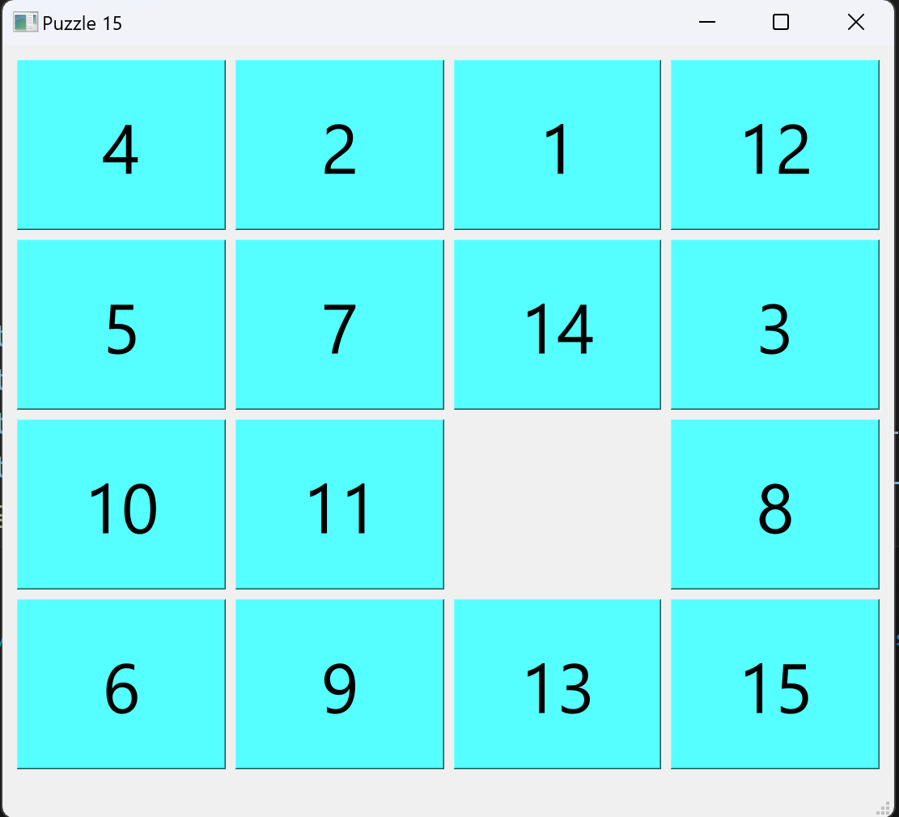
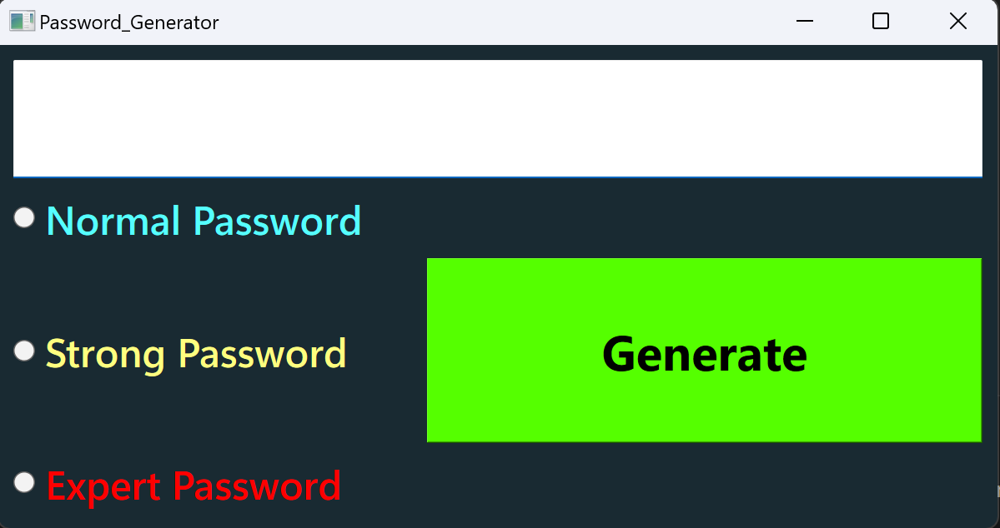
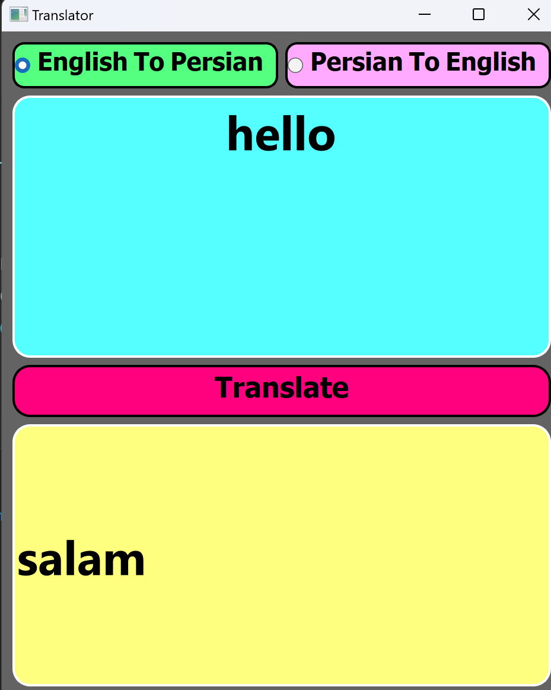
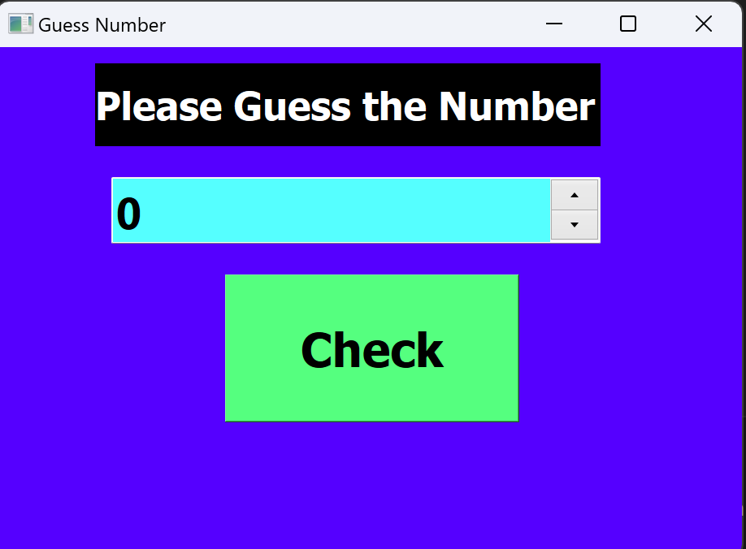
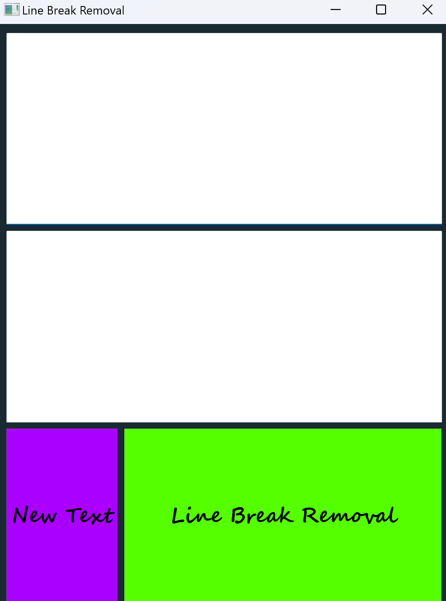

># Assignment_19

## Files Description

| File name | Description |
|--- | --- |
|15 Puzzle.py | Simple  15 Puzzle Game    |
|Line Break Removal | Simple App for remove break lines |
|Password Generator.py | Simple password generator |
|Translator.py | Simple Translator program |
|Guess Number.py | Simple Guess Number Game|


># 15 Puzzle 

## Overview

The 15 Puzzle Game is a simple yet challenging game where you need to rearrange the puzzle pieces to complete the picture.

## Instructions

To win the Puzzle Game, follow these instructions:

1. Click on a puzzle piece next to the empty space to move it into the empty space.
2. Continue moving pieces until the puzzle is solved.

## Controls

 Click on a puzzle piece to move it.

## How to Run
execute this command in terminal:

```
python Puzzle_15.py
```


# Output:



># Password Generator

## Overview

The Password Generator is a tool that creates secure passwords based on user preferences.

## Instructions

To use the Password Generator, follow these instructions:

1. Select the desired password length.
2. Choose the complexity level (Normal, Strong, Very Strong).
3. Click the "Generate" button.

## Controls

- Password Length Slider
- Complexity Level Radio Buttons
- Generate Button

## How to Use

1. Adjust the password length using the slider.
2. Select the desired complexity level.
3. Click the "Generate" button to get your password.

## How to Run
execute this command in terminal:

```
python Password_Generator.py
```

# Output:



># Translator App

## Overview

The Translator App helps users translate text between English and Persian.

## Instructions

To use the Translator App, follow these instructions:

1. Enter the text you want to translate in the input field.
2. Choose the translation direction (Persian to English or English to Persian).
3. Click the "Translate" button.

## Controls

- Input Text Field
- Translation Direction Radio Buttons
- Translate Button

## How to Use

1. Enter the text in the input field.
2. Select the translation direction.
3. Click the "Translate" button to get the translated text.


## How to Run
execute this command in terminal:

```
python Translator.py
```


# Output:


># Guess Number

## Overview 

In this game you should guess a number between 1 and 50 , and enter it in the white box .
Then press "Guess" button , to find out whether your guess was correct or not . 


## Instructions

If your guess be more than selected number, the message "go down ↓" is showed.

If your guess be less than selected number, the message "go up ↑" is showed.


## How to Run

execute this command in terminal:

```
python Guess_Number.py
```


# Output:


># Line_Break_Removal

## Overview 

A program with which you can remove the space between paragraphs


## How to Run

execute this command in terminal:

```
python line_break_removal.py
```

# Output:



